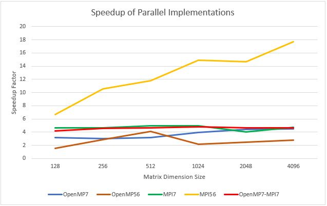

# MatrixMultiplicationParallelization
Algorithms that increase the speed of matrix multiplication using parallel programming

## Summary
As part of a group project in college,  I attempted to increase the performance of matrix multiplication using parallel programming techniques. First, I created a serial implementation of the [Strassen matrix multiplication algorithm](https://iq.opengenus.org/strassens-matrix-multiplication-algorithm/) in C++. I then created several C++ parallel implementations of Strassen's method with the [OpenMP](https://en.wikipedia.org/wiki/OpenMP) and [MPI](https://en.wikipedia.org/wiki/Message_Passing_Interface) parallel programming libraries. Finally, I ran all implementations on a university supercomputer and compared runtimes.

## Implementations
The implementations all auto-generate 2 square matrices filled with random integers given a matrix dimension size and maximum matrix element value specified at execution time. The algorithms then time how long it takes to multiply the 2 matrices together. Each implementation was run using a variety of matrix dimension sizes to see how the implementation scaled as the matrices multiplied together got larger.

* [StrassenSerial.cpp](StrassenSerial.cpp) - A serial implementation of Strassen's matrix multiplication algorithm
* [OpenMP7.cpp](OpenMP7.cpp) - A parallel implementation that runs with 7 threads on one multi-core CPU as long as the dimension size of the matrices being multiplied together is greater than 2
* [OpenMP56](OpenMP56.cpp) - A parallel implementation that runs with up to 56 threads on one multi-core CPU depending on the dimension size of the matrices
* [MPI7.cpp](MPI7.cpp) - A parallel implementation that concurrently uses 7 CPUs/nodes for matrix multiplication as long as the dimension size is greater than 2 
* [MPI56.cpp](MPI56.cpp) - A parallel implementation that uses up to 56 CPUs/nodes for matrix multiplication depending on the matrix dimension size
* [OpenMP7-MPI7.cpp](OpenMP7-MPI7.cpp) - A parallel implementation that uses up to 7 CPUs/nodes and runs up to 7 threads on each CPU for matrix multiplication

## Results

